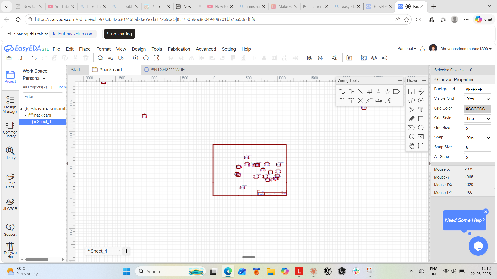
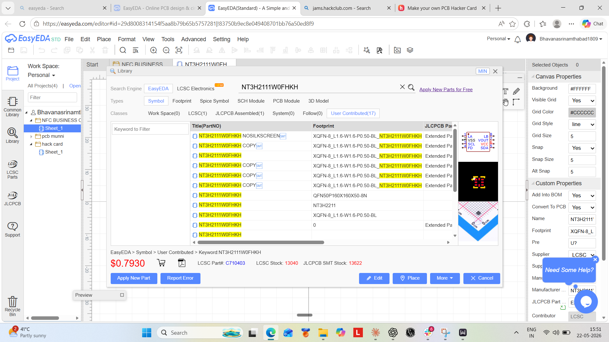
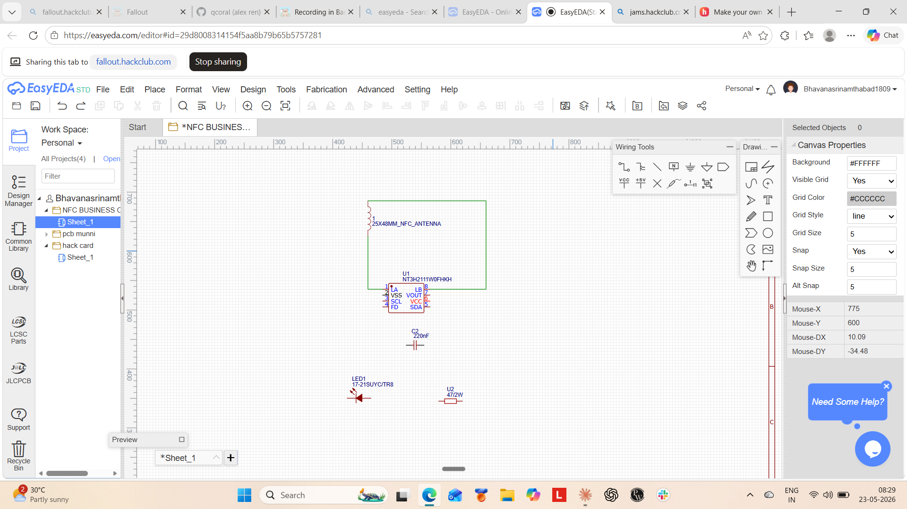
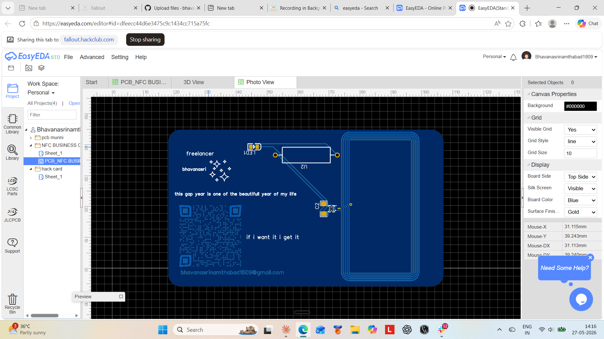
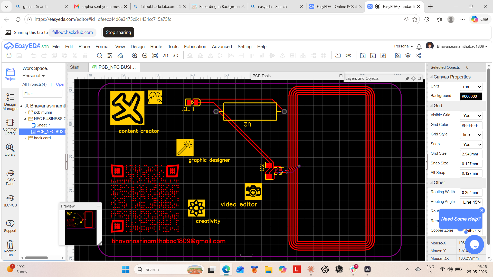
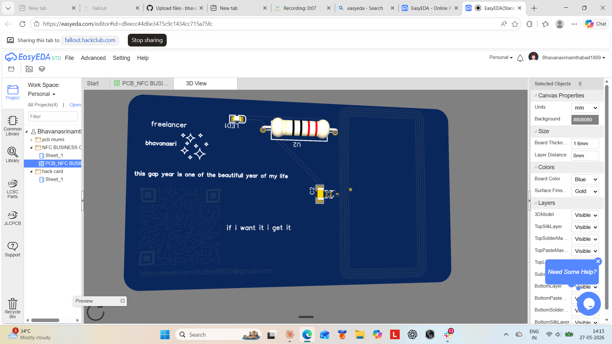
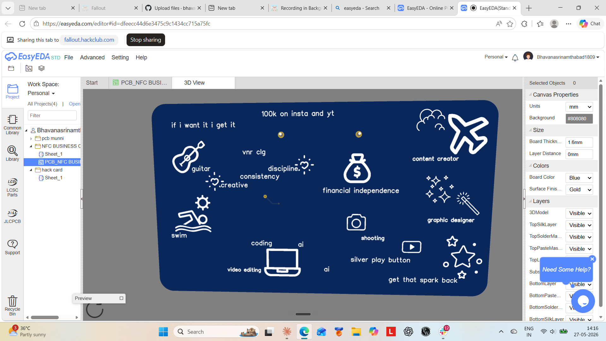

# Gap Year Manifestation Card 🌟

## What is this?

This is my first ever PCB design — a **Gap Year Manifestation Card**.

It started as a simple idea: make an NFC business card with my Instagram QR code
and phone number. But as I kept working on it, something shifted in me. I'm currently
on a gap year, and I wanted this card to mean something more. So I turned it into a
**Gap Year Manifestation Card** — a physical reminder of this chapter of my life,
the risks I'm taking, and the person I'm becoming.

---

## The Journey — Every Step, Every Mistake 🚀

### Step 1 — Where It All Began (And Where The Mistakes Did Too)

This is where it started. You can see the red lines — errors everywhere.
But here's what I learned: **everything starts with a mistake.**
You make a ton of them in the beginning, and then at some point,
something shifts. It starts feeling like *"yeah, this is where it's going."*
You have to be okay with mistakes at the start in order to move forward.

---

### Step 2 — The 0 vs O Moment 🤦

This one broke my brain a little.
While choosing components, I was writing **0 (zero) as O (the letter).**
It took me **two whole hours** to figure out what was going wrong.
Two hours. For one character. I couldn't believe it.
But honestly? That's how learning works sometimes.

---

### Step 3 — The Moment Everything Made Sense ✨

This is the turning point.
All the components finally fell into place.
My mistakes, my faults, all the confusion —
suddenly it all made sense here.
This is where it started feeling good.

---

### Step 4 — Schematic to PCB, Pure Happiness 😄

This is where I converted all the components into the actual PCB layout.
I remember being genuinely happy at this stage.
Like, *"wait, this is actually working?"* Yes. Yes it was.

---

### Step 5 — Welcome to the PCB World (Hello Confusing Blue Lines)

We are officially in PCB layout territory now.
Copper lines, blue lines, yellow lines — it's all here.
But those **blue lines?** I cannot even explain how confused they made me.
So. Much. Confusion.

---

### Step 6 — The Layer War 😤

This is where the real chaos began — top layer, bottom layer,
top silk layer, bottom silk layer.

I saw yellow text and thought it was on the bottom silk layer. It wasn't.
So I moved everything to the bottom silk layer thinking it would fix it. It didn't.
Then I changed everything to blue thinking the bottom layer was the problem. It wasn't.

I went back and forth so many times.
Eventually I figured it out — but this stage tested my patience like nothing else.

---

### Step 7 — The 3D View 🤩 (Front Side)

This is the **3D view of the front side** of my PCB.
Seeing it in 3D for the first time after all that struggle?
Unreal feeling.

---

### Step 8 — The Back Side — My Manifestations 🌟

This is the **back side** of the card — and this is where it gets personal.

I wrote down my goals. My dreams. The things I'm working towards
during this gap year that most people don't understand:

- 100k on Instagram and YouTube
- Financial independence
- Shooting a Silver Play Button
- Coding
- Video editing
- AI
- Filming
- Becoming a graphic designer again
- Re-entering college
- Learning guitar 🎸 (a dream I'm holding onto)

This side of the card is my manifestation board. In PCB form.

---

### Final — The Complete 2D View ✅

This is the final 2D view of the completed design.
Every layer in place. Every component where it belongs.
Every mistake that led here — worth it.

*"this gap year is one of the beautiful year of my life"*
*"if i want it i get it"*

---

## The Real Struggles 😅

- 🔄 Redrew my doodles **4 times** — kept messing up, kept starting over
- 💀 Lost my work once because I forgot to save
- ✨ Wanted a gold shiny ENIG finish — spent hours trying to get it right
- 🤯 The layers absolutely broke my brain at the start
- 🔧 Figured it all out alone — just me, YouTube, and sheer stubbornness
- 
  ###how to use
Just tap it with any NFC-enabled phone — it instantly opens my Instagram. No app needed, no typing, just tap and connect.
But honestly this card is more than just a business card. I'm going to carry it everywhere — every hackathon I attend, every person I meet, every moment I want to share what I'm building. It fits right in my pocket.
And on the back? Those aren't just doodles. Those are my goals — 100k on Instagram and YouTube, financial independence, coding, guitar, graphic design, getting that spark back. I see them every single day and they keep me going.
This gap year is mine. And this card proves it. 🌟
  ### zine page

## How Hack Club Helped 💙

I did this as part of **Fallout by Hack Club**, and the community
helped me a lot when I was stuck. Having people around who are building
the same kind of stuff — even online — makes a huge difference
when you're learning completely alone.

---

## What Changed in Me 🌱

This project isn't just a PCB.
It's proof to myself that I can pick up something completely new,
struggle through it, and come out the other side with something real.

From someone who didn't even know what a PCB layer was —
to someone who designed one, from scratch, alone, in 10 hours.

That's the real win. 🙌

---

## Tools Used
- **EasyEDA** — Schematic & PCB Layout Design

## Program
Made as part of **Fallout** by [Hack Club](https://hackclub.com)

## Status
✅ Design Complete
